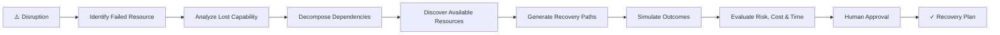
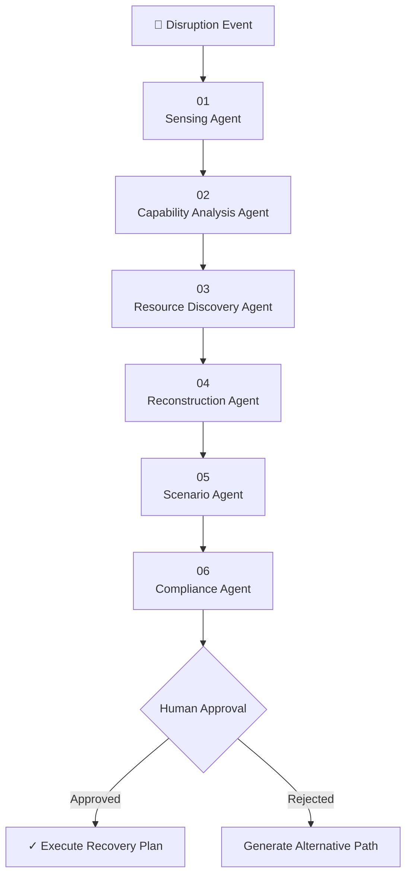
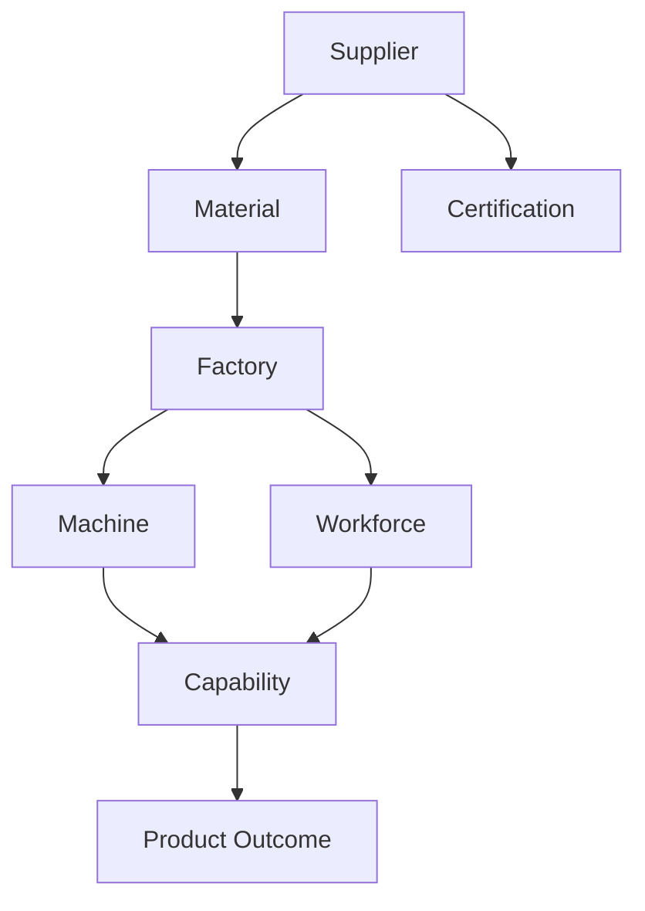
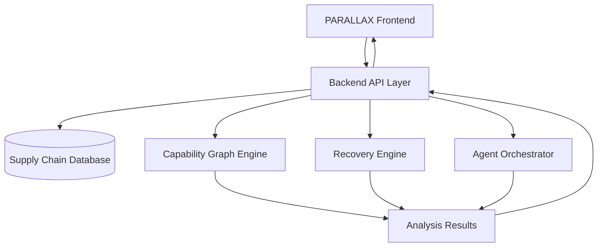

<div align="center">

# PARALLAX

### Same outcome. Different path.

**AI-powered capability reconstruction for resilient supply chains.**

<br />

[](#)
[](#)
[](#)
[](#)

<br />

> **When a dependency fails, don't just replace it. Reconstruct the capability it provided.**

<br />

[🚀 Explore Concept](#-the-idea)
&nbsp;&nbsp;
[⚡ How It Works](#-how-parallax-works)
&nbsp;&nbsp;
[🧠 Architecture](#-system-architecture)
&nbsp;&nbsp;
[🔥 Chaos Simulation](#-break-my-supply-chain)
&nbsp;&nbsp;
[👥 Team](#-team)

</div>

---

# 🌍 The Problem

Modern supply chains are built around **resources**:

- Suppliers
- Factories
- Machines
- Routes
- Inventory
- Workforce

When one fails, the traditional response is usually:

```text
Supplier fails
      ↓
Find another supplier
      ↓
Wait for replacement
      ↓
Production risk
````

But this approach misses a fundamental question:

> **What capability did we actually lose?**

Five suppliers may appear independent...

...while all five depend on the same hidden certification, machine, logistics route, or workforce capability.

### Supplier redundancy ≠ Capability redundancy.

---

# 💡 The Idea

PARALLAX takes a fundamentally different approach.

Instead of asking:

> ❌ "Who can replace this supplier?"

PARALLAX asks:

> ✅ "What capability was lost, and how can we reconstruct it using different combinations of available resources?"



---

# ⚡ How PARALLAX Works

## 1️⃣ A disruption occurs

Example:

> **MedCore Components Ltd. goes offline.**

```text
RESOURCE FAILURE
────────────────────

Supplier: MedCore Components
Status: OFFLINE
Impact Window: 72 Hours
Severity: CRITICAL
```

↓

## 2️⃣ PARALLAX identifies what was actually lost

Instead of stopping at:

> Supplier unavailable ❌

PARALLAX analyzes:

```text
THERMOSHIELD PACKAGING CAPABILITY
│
├── Temperature Resistant Material
├── Precision Forming
├── Quality Certification
├── Cold-Chain Handling
├── Skilled Workforce
└── Regional Logistics
```

### Key insight:

> **The supplier failed. The capability may not have.**

↓

## 3️⃣ The system discovers available resources

PARALLAX searches across the network:

```text
AVAILABLE RESOURCES
──────────────────────────

✓ Alternative Supplier
✓ Idle Machine
✓ Available Factory Capacity
✓ Existing Inventory
✓ Transferable Workforce
✓ Alternative Logistics Route
```

↓

## 4️⃣ Multiple recovery paths are generated

### PATH A — Direct Replacement

```text
MedCore ❌
   ↓
BioPack Systems ✓

Recovery: 14 Days
Risk: Medium
Cost: ₹18.4L
```

### PATH B — Alternate Manufacturing

```text
NorthStar Materials
        +
Plant 04
        +
Existing Inventory

Recovery: 7 Days
Risk: Medium-Low
Cost: ₹9.2L
```

### PATH C — Capability Reconstruction ⭐

```text
Existing Inventory
        +
NorthStar Materials
        +
Plant 02
        +
CNC-17
        +
Transferable Workforce
        +
Alternative Logistics
        ↓

THERMOSHIELD CAPABILITY RESTORED
```

```text
Recovery Time     3.2 Days
Estimated Cost    ₹3.4L
Capacity Coverage 91%
Dependency Risk   LOW

Recovery Score    94 / 100
```

> 🏆 **PARALLAX Recommendation**

---

# 🧠 Agentic Intelligence

PARALLAX uses a collaborative multi-agent workflow.



| Agent                    | Responsibility                          |
| ------------------------ | --------------------------------------- |
| **Sensing Agent**        | Detects and classifies disruptions      |
| **Capability Agent**     | Identifies what capability was affected |
| **Resource Agent**       | Discovers available resources           |
| **Reconstruction Agent** | Generates alternative configurations    |
| **Scenario Agent**       | Simulates and compares recovery paths   |
| **Compliance Agent**     | Checks operational constraints          |
| **Human**                | Approves high-impact decisions          |

> PARALLAX is not a collection of chatbots. Each agent performs a specialized task within a coordinated decision workflow.

---

# 🕸️ Capability Graph

The intelligence behind PARALLAX is a **capability dependency graph**.



When a resource fails, PARALLAX can trace:

* Upstream dependencies
* Downstream impact
* Hidden single points of failure
* Capability redundancy
* Alternative reconstruction paths

---

# 🔥 Break My Supply Chain

## Stress-test your network before reality does.

PARALLAX includes an interactive chaos simulation engine.

Users can deliberately simulate failures:

```text
☑ Remove Critical Supplier
☑ Disable Factory
☑ Disable Machine
☑ Block Logistics Route
☑ Remove Specialized Workforce
☑ Trigger Multiple Failures
```

Then PARALLAX recalculates the network.

```text
NETWORK RESILIENCE

Before Simulation

██████████████████░░ 87/100


Failure Injected

        ⚠


After Simulation

███████████░░░░░░░░░ 54/100
```

### Hidden vulnerability detected

```text
SUPPLIER REDUNDANCY

5x


CAPABILITY REDUNDANCY

1x ⚠️
```

# 5 suppliers ≠ 5 independent recovery paths.

This allows organizations to discover vulnerabilities **before an actual disruption occurs**.

---

# 👷 Workforce as a Resilience Resource

PARALLAX also models workforce through **capabilities rather than job titles**.

```text
REQUIRED CAPABILITY

Precision Packaging Operation
```

The system evaluates:

```text
EMP-1842

Machine Operation       █████████░ 92%
Quality Inspection      ████████░░ 81%
Precision Forming       ███████░░░ 76%

Overall Compatibility   87%

Training Gap            9%

Recommendation

→ Deploy after targeted training
```

> Workforce becomes part of the recovery network.

---

# 🏗️ System Architecture



---

# 🛠️ Technology Stack

### Frontend

* React
* TypeScript
* Vite
* Tailwind CSS
* Lovable

### Backend

* API Layer
* PostgreSQL / Supabase

### Intelligence

* Capability Dependency Graph
* Graph Traversal
* Recovery Path Generation
* Scenario Simulation
* Agent Orchestration

### AI

* LLM-powered reasoning
* Multi-agent workflow
* Human-in-the-loop decision making

### Visualization

* Interactive Supply Chain Graphs
* Capability Maps
* Resilience Metrics
* Chaos Simulation

---

# 📊 Core Product Modules

| Module                       | Purpose                             |
| ---------------------------- | ----------------------------------- |
| 🚨 Disruption Detection      | Detect and classify failures        |
| 🕸️ Capability Graph         | Understand dependency relationships |
| 🔍 Resource Discovery        | Find available resources            |
| 🧩 Capability Reconstruction | Generate alternative configurations |
| 📈 Scenario Engine           | Compare recovery paths              |
| 🔥 Chaos Simulation          | Stress-test the network             |
| 🤖 Agent Orchestration       | Coordinate intelligent workflows    |
| 👤 Human Approval            | Keep critical decisions accountable |
| 📜 Audit Trail               | Track system decisions              |

---

# 🎯 Core Innovation

Traditional supply-chain resilience:

```text
Resource A fails
      ↓
Find Resource B
```

PARALLAX:

```text
Resource A fails
      ↓
What capability did it provide?
      ↓
What dependencies create that capability?
      ↓
Which resources are still available?
      ↓
Can we combine them differently?
      ↓
Generate alternative configurations
      ↓
Simulate consequences
      ↓
Recommend optimal recovery
```

## The shift

```text
FROM

Resource Replacement
        ↓

TO

Capability Reconstruction
```

---

# 📁 Project Structure

```text
capability-navigator/

├── src/
│
│   ├── components/
│   │   ├── dashboard/
│   │   ├── disruption/
│   │   ├── capability/
│   │   ├── recovery/
│   │   └── simulation/
│   │
│   ├── pages/
│   │
│   ├── services/
│   │   ├── api.ts
│   │   ├── disruptionService.ts
│   │   ├── graphService.ts
│   │   ├── recoveryService.ts
│   │   ├── simulationService.ts
│   │   └── agentService.ts
│   │
│   ├── types/
│   │
│   └── utils/
│
├── public/
│
└── README.md
```

---

# 🚀 Getting Started

## Clone the repository

```bash
git clone https://github.com/gilldilshaan/capability-navigator.git
```

## Navigate to the project

```bash
cd capability-navigator
```

## Install dependencies

```bash
npm install
```

## Run locally

```bash
npm run dev
```

Open:

```text
http://localhost:5173
```

---

# 🎬 Demo Flow

The recommended demo sequence:

```text
1. Open Resilience Command Center

        ↓

2. Show Critical Supplier Disruption

        ↓

3. Run Agent Analysis

        ↓

4. Reveal Lost Capability

        ↓

5. Explore Capability Dependencies

        ↓

6. Discover Available Resources

        ↓

7. Generate Recovery Paths

        ↓

8. Compare Scenarios

        ↓

9. Select Recommended Path

        ↓

10. Human Approval

        ↓

11. Break My Supply Chain

        ↓

12. Reveal Hidden Vulnerability
```

---

# 👥 Team PARALLAX

<table>
<tr>
<td align="center">

### Dilshaan Gill

**Frontend & Integration**

</td>

<td align="center">

### Bani

**Backend & Database**

</td>

<td align="center">

### Suvreen

**Capability Graph Engine**

</td>

<td align="center">

### Diya

**Recovery & Simulation Engine**

</td>

<td align="center">

### Riya

**Agentic AI & Orchestration**

</td>
</tr>
</table>

---

# 🧭 Our Vision

Supply chains should not only react to failures.

They should understand:

* What truly matters
* What capabilities are vulnerable
* What hidden dependencies exist
* How systems can adapt
* How outcomes can be reconstructed

---

<div align="center">

# PARALLAX

### Same outcome. Different path.

**Reimagining supply-chain resilience through capability reconstruction.**

<br />

Built for **Hackfest 2026**

<br />

⭐ **If you find the concept interesting, consider starring the repository.**

</div>
```
